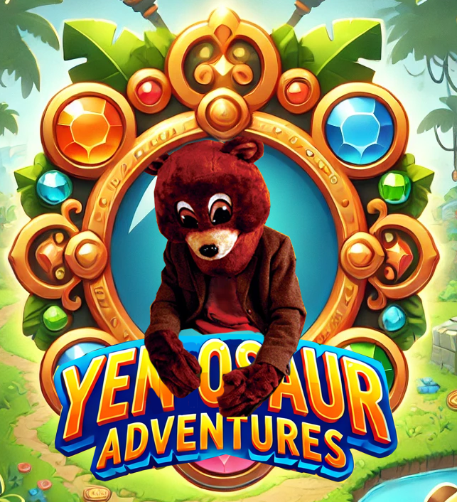

# YENOSAUR ADVENTURES QUIZ :microphone::bear:

<a href="https://lucasaued.itch.io/yenosaurquiz"></a>

*Identificação:*
- *Autores:* Diego Rockenbach & Lucas Aued.
- *Curso*: Sistemas de Informação - Universidade Federal de Santa Maria.

### Sobre o jogo: :teddy_bear:
<p align="justify">O jogador deve testar seus conhecimentos ao controlar o protagonista do jogo, Kanye West, para colidir com as respostas certas do Quiz. As perguntas do jogo abrangem o contexto do Geoparque Quarta Colônia, referência para Santa Maria e região. <br><br> Por meio do jogo, o jogador poderá expandir seus conhecimentos sobre cultura e arqueologia, além de se divertir com Ye. :disguised_face: <br><br> O jogo é o projeto final da disciplina de Paradigmas da Programação. Seu desenvolvimento foi feito em Java, utilizando-se do framework LibGDX.<br><br><br><br></p>

## História: :speech_balloon:
No jogo, o usuário irá controlar o rapper e compositor americano Kanye West, que veio para Santa Maria visitar e conhecer as maravilhas da Quarta Colônia! Através das perguntas respondidas com auxílio do jogador ele poderá conhecer mais sobre nossa região, assim aproveitando seu passeio, sendo contratado pelo Pozzobom pra tocar na Gare e se reencontrando na música. :egg: :right_anger_bubble:

## Mecânicas: :gear:
- Controle: Feito inteiramente através do mouse.
- Múltiplas telas: Que alternam com o estado de jogo atual.
- Quizzes: Perguntas sobre o Geoparque Quarta Colônia.
- Sistema de pontos: Acertos e Erros contabilizados na partida.

## Perguntas do Quiz: :question:
- Que fósseis são encontrados no Geoparque?
- Que universidade é parceira do geoparque?
- Quais as princiapsi riquezas do geoparque?
- Quantos municípios fazem parte do geoparque?
- Qual município faz parte do geoparque?
- Qual o principal foco científico do geoparque?
- Em que ano foi criado o projeto do Geoparque Quarta Colônia?
- Qual organização reconheceu o Geoparque à nível mundial?
- É exemplo de geossitio do Geoparque?
- Qual o maior atrativo natural do geoparque?
  
## Desenvolvimento: :headphones:

<p align="justify">Durante o processo de decisão de como iriamos elaborar nosso próprio projeto, gostamos muito de uma das propostas de inspiração trazidas pela professora, o jogo Riddles in the Sky. A partir disso, buscamos implementar no projeto interesses pessoais mútuos, como o bom gosto pela música, e ao mesmo tempo, atender aos requisitos solicitados para a elaboração do projeto. <br><br>De início, encontramos algumas dificuldades na configuração e ambientação com a LibGDX. Todavia, após isso, os passos iniciais fluíram muito bem, implementando movimentação do jogador e colisão com objetos. Entretanto, tudo que é bom dura pouco. Ao começarmos a implementar as perguntas do quiz diversos problemas surgiram, principalmente na manipulação como um todo dos vetores das respostas, seja sua movimentação, diferenciação entre as duas respostas que estavam na tela, intervalo entre perguntas, etc. Esses problemas levaram muito esforço e tempo (mais do que o planejado hihi) pra serem resolvidos. <br><br>Sabendo que o tempo é relativo e antes tarde do que nunca, seguimos no projeto sabendo que a pior parte havia passado. A implementação de telas diversas (menu, tela principal de jogo e de finalização) renderam poucos empecilhos, assim como o sistema de erros e acertos. Dizemos com tranquilidade que o trabalho em si foi igualmente desafiador e divertido.</p>

> [!NOTE]
> Comando usado para buildar/rodar o projeto:
 ```./gradlew build; ./gradlew lwjgl3:run```

## Referências:
> [LibGDX WIKI](https://libgdx.com/wiki/app/the-life-cycle)

> [Video sobre Colisões LibGDX](https://www.youtube.com/watch?v=oYsA9PGCkQA)

> [Game Screens](https://happycoding.io/tutorials/libgdx/game-screens)

> [Gerador Assets](https://www.kdau.com/scrollish/)

> Ferramentas IA (também majoritariamente para geração de assets extra-código)

